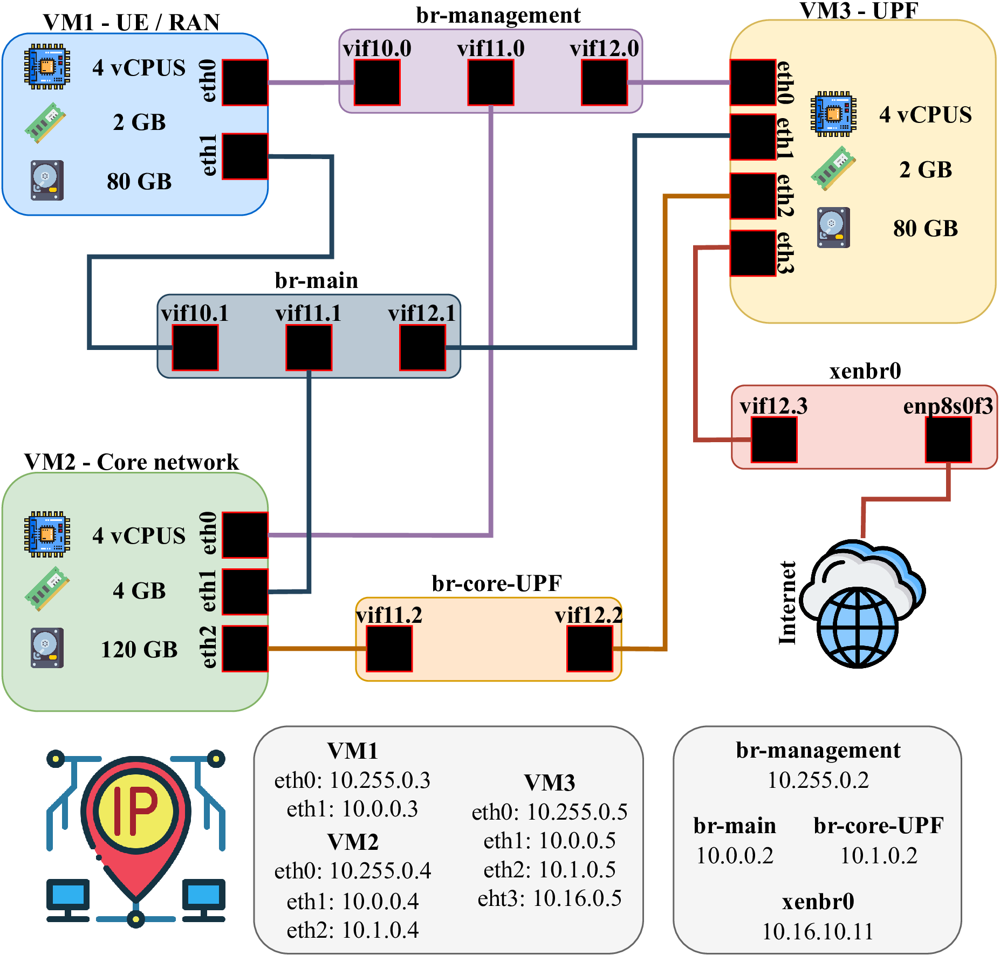
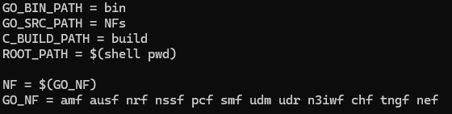

# free5GC - UPF Separado (Topologia Customizada)

Este repositório é um tutorial para modificação do repositório OpenSource do free5GC (https://github.com/free5gc/free5gc), com o objetivo de separar a UPF (User Plane Function) da VM principal do núcleo do 5G. Essa separação permite uma arquitetura mais modular, próxima de ambientes reais de telecomunicações, facilitando testes de desempenho e escalabilidade.

---

## 🧪 Contexto do projeto

Este trabalho foi desenvolvido por Ícaro de Paiva Rocha durante uma Iniciação Científica no Laboratório Labora da Universidade Federal de Goiás (UFG), com foco em arquitetura de redes 5G, virtualização e desagregação do plano de controle e plano de usuário.

---

## 🔧 Alterações principais

- Separação da UPF em uma VM dedicada (VM3);
- VM2 mantém os demais componentes do núcleo do 5GC;
- Configuração de múltiplas bridges virtuais para roteamento (br-main, br-core-UPF, xenbr0, etc.);
- Design modular com múltiplas interfaces por VM;
- Topologia adaptada para testes acadêmicos e laboratoriais.

---

## 🖼️ Topologia da rede



---

## 💻 Requisitos

- Ubuntu Server (20.04 ou 22.04 recomendado)
- Mínimo de 2 VMs (Core, UPF)
- Docker e Go (para compilação dos componentes do free5GC)

---


## Instalando dependências
## 1: Verifique se o Go já está instalado

Abra o terminal e execute:

## 1: Verifique se o Go já está instalado

Abra o terminal e execute:

	go version
	
## 2: Remover instalação anterior


	sudo rm -rf /usr/local/go
	wget https://dl.google.com/go/go1.21.8.linux-amd64.tar.gz
	sudo tar -C /usr/local -zxvf go1.21.8.linux-amd64.tar.gz


## 3: Se o GO não estiver instalado


	wget https://dl.google.com/go/go1.21.8.linux-amd64.tar.gz
	sudo tar -C /usr/local -zxvf go1.21.8.linux-amd64.tar.gz
	mkdir -p ~/go/{bin,pkg,src}
	# Assumindo que seu shell é bash:
	echo 'export GOPATH=$HOME/go' >> ~/.bashrc
	echo 'export GOROOT=/usr/local/go' >> ~/.bashrc
	echo 'export PATH=$PATH:$GOPATH/bin:$GOROOT/bin' >> ~/.bashrc
	echo 'export GO111MODULE=auto' >> ~/.bashrc
	source ~/.bashrc


## 4: Verificar versão do GO:


	go version

OBS: Esse procedimento deve ser executados nas duas VM's

## 🚀 Configurando as máquinas

Garanta que o go foi instalado corretamente antes de prosseguir com os próximos passos

### 1. Clone o repositório do free5gc em cada VM (Core e UPF):

```bash
git clone https://github.com/free5gc/free5gc
``` 
## Para a máquina do CORE

1. Entre no diretório do free5gc:

```bash
cd free5gc
```

2. Retire a upf do campo GO_NF (como mostra a figura abaixo):



3. Rode o arquivo Makefile:

```bash
cd make
```

## License

free5GC is now under [Apache 2.0](https://github.com/free5gc/free5gc/blob/master/LICENSE.txt) license.

